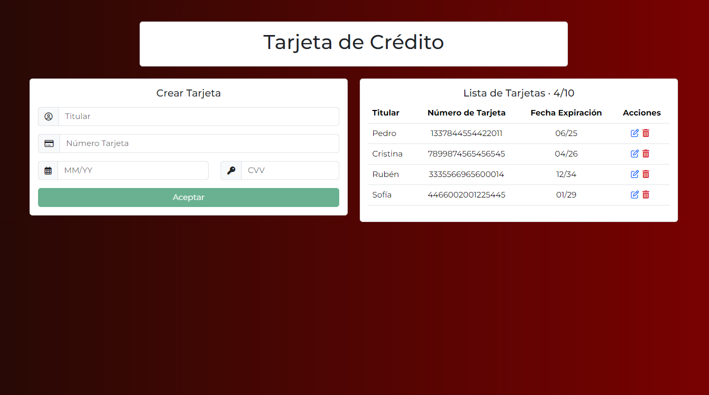
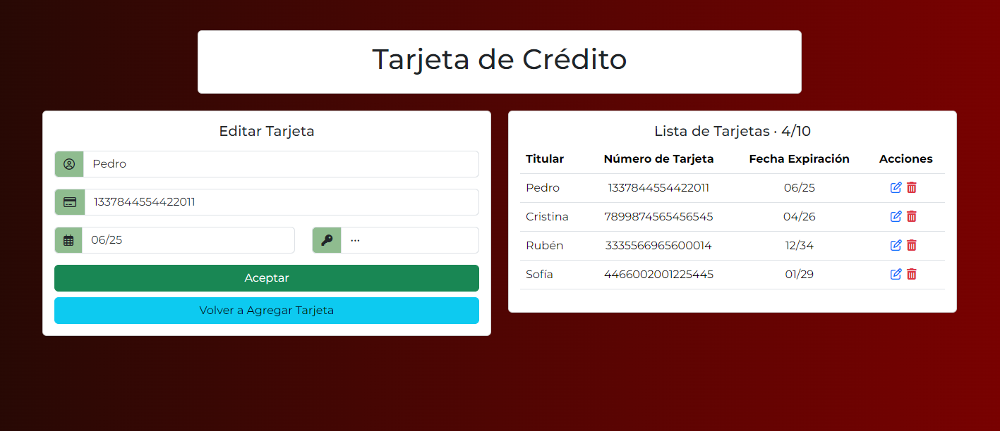

# App Tarjeta de Crédito

Esta aplicación web permite gestionar tarjetas de crédito a través de un formulario sencillo. Los usuarios pueden añadir nuevas tarjetas a la base de datos, verlas en una lista, y realizar acciones como editar o eliminar las tarjetas existentes.

## Stack Tecnológico

- HTML5, CSS3, Bootstrap, JavaScript, TypeScript
- Angular (18.0.5)
- Firebase (Firestore)

*Se ha usado ngx-env para las variables de entorno (.env)*

## Enlaces

- [Link al Live: https://app-tarjeta-credito-4p8m5sqjr-rubpris-projects.vercel.app/](https://app-tarjeta-credito-4p8m5sqjr-rubpris-projects.vercel.app/)

## Imágenes de la App

## Perfiles

- 
- 

